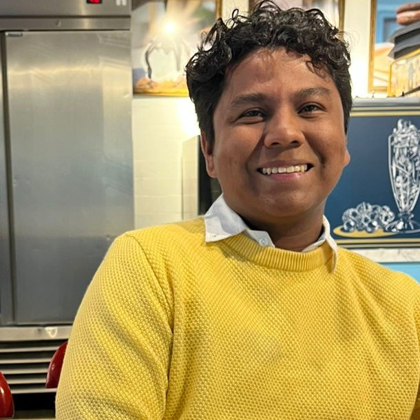

:::: {.grid .hero-section}

::: {.g-col-12 .g-col-md-4 .hero-left}

{width=90% fig-align="center"}

Andrés André Camargo Bertel

PhD Candidate in Mechanical Engineering \
Universidad del Norte \
Barranquilla, Colombia \
Email: camargoaa@uninorte.edu.co

::: {.hero-links}
[<i class="ai ai-google-scholar"></i> Google Scholar](https://scholar.google.com/citations?user=RTRoJm0AAAAJ){.external target="_blank"}

[<i class="ai ai-orcid"></i> ORCID](https://orcid.org/0000-0001-8192-8254){.external target="_blank"}

[<i class="ai ai-researchgate"></i> ResearchGate](https://www.researchgate.net/profile/Andres-Camargo-Bertel){.external target="_blank"}

[<i class="ai ai-scopus"></i> Scopus](https://www.scopus.com/authid/detail.uri?authorId=59319653100){.external target="_blank"}

[<i class="ai ai-clarivate"></i> Web of Science](https://www.webofscience.com/wos/author/record/GQB-3417-2022){.external target="_blank"}

[<i class="fa-brands fa-github"></i> GitHub](https://github.com/camargo-aa){.external target="_blank"}

[<i class="fa-brands fa-linkedin"></i> LinkedIn](https://www.linkedin.com/in/andrés-andré-camargo-bertel-91916319b){.external target="_blank"}
:::

:::

::: {.g-col-12 .g-col-md-8 .hero-right}

Andrés André Camargo Bertel is a Mechanical Engineer, M.Sc. in Mechanical Engineering, and PhD Candidate at [Universidad del Norte](https://www.uninorte.edu.co){.external target="_blank"} in Barranquilla, Colombia. His work specializes in energy systems modeling, transport decarbonization, and industrial decarbonization.

He combines short-, medium-, and long-term energy modeling with renewable energy integration analysis and systems optimization to support data-driven decision-making. He has strong experience in energy systems simulation using [EnergyPLAN](https://www.energyplan.eu){.external target="_blank"} and [OSeMOSYS](https://www.osemosys.org){.external target="_blank"}, together with data analysis in Python and R—bridging technical and policy perspectives to design low-carbon development pathways across Latin America.

He currently works as an Energy Modeler at the National Mining and Energy Planning Unit ([UPME](https://www.upme.gov.co){.external target="_blank"}), supporting Colombia's national energy planning, and is a member of the [UREMA Research Unit](https://www.uninorte.edu.co/web/urema){.external target="_blank"} at Universidad del Norte.

Driven by a passion for research and innovation, he aims to connect energy modeling with policymaking to support a just and sustainable energy transition.

### Education

- **PhD Candidate in Mechanical Engineering** — Universidad del Norte, Colombia (2024–2028, expected)
- **M.Sc. in Mechanical Engineering** — Universidad del Norte, Colombia (2022–2024)
- **B.Sc. in Mechanical Engineering** — Universidad del Norte, Colombia (2017–2021)

### Experience

- **Energy Modeler / Energy Data Analyst**, National Mining and Energy Planning Unit (UPME) — Colombia (2025–present). Energy system modeling for Colombia's national government to support informed policy decision-making.
- **Teaching Assistant**, Universidad del Norte (2022–2025). Thermodynamics I & II, Fluid Mechanics Laboratory, Process Instrumentation and Control Laboratory, Manufacturing Processes Laboratory, and Dynamic Systems Modeling.
- **Consulting Engineer–Researcher**, Universidad del Norte (2022–2026). Applied engineering projects including a national green-ammonia roadmap, transport electrification scenarios, carbon-monoxide dispersion modeling, and a Gecelca hydrogen pilot.

::: {.hero-links style="margin-top: 1.5rem;"}
[<i class="fa-solid fa-file-lines"></i> Full CV (PDF)](files/CV_Andres_Andre_2026.pdf){target="_blank"}
:::

:::

::::
