```{=html}
<div class="page-banner page-banner-home">
  <div class="page-banner-bg" style="background-image:url('/files/images/menu/bio-home.png')"></div>
  <div class="page-banner-overlay"></div>
  <div class="page-banner-fade page-banner-fade-long"></div>
</div>
```

::: {.background-frame .alt-background}
::: {.content-block}

<div style="height: 40px;"></div>

::: {.grid}
::: {.g-col-12 .g-col-md-5 .hero-left}

[{width=90% fig-align="center" fig-alt="Portrait of Andrés André Camargo Bertel"}](bio.qmd)

:::

::: {.g-col-12 .g-col-md-7 .hero-right}

```{=html}
<h1 class="home-name">Andrés André Camargo Bertel</h1>
```

<p align="center" style="font-size:1.4rem;">
PhD Candidate in Mechanical Engineering\
Universidad del Norte\
Barranquilla, Colombia\
Email: camargoaa@uninorte.edu.co
</p>

::: {.button}
[Full Bio](bio.qmd){.btn-action-primary .btn-action .btn .btn-success .btn-lg role="button" style="margin-top: 0em;"}
:::



:::
:::

:::
:::

::: {.background-frame}
::: {.content-block}

## Latest Papers {.home-section}

```{=html}
<div class="paper-cards-grid">

<a href="posts/paper-2026-steel-industry-decarbonization/" class="paper-stack-card">
<div class="paper-stack">
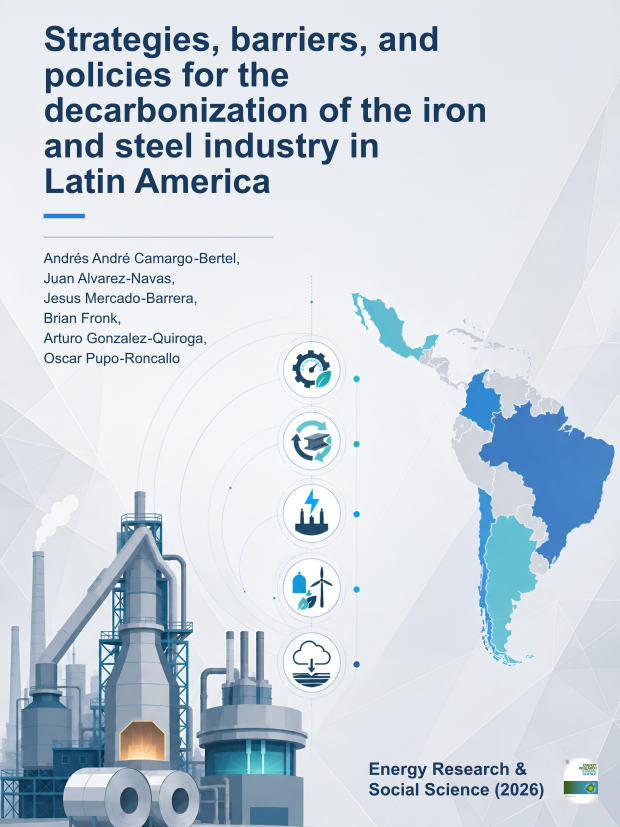
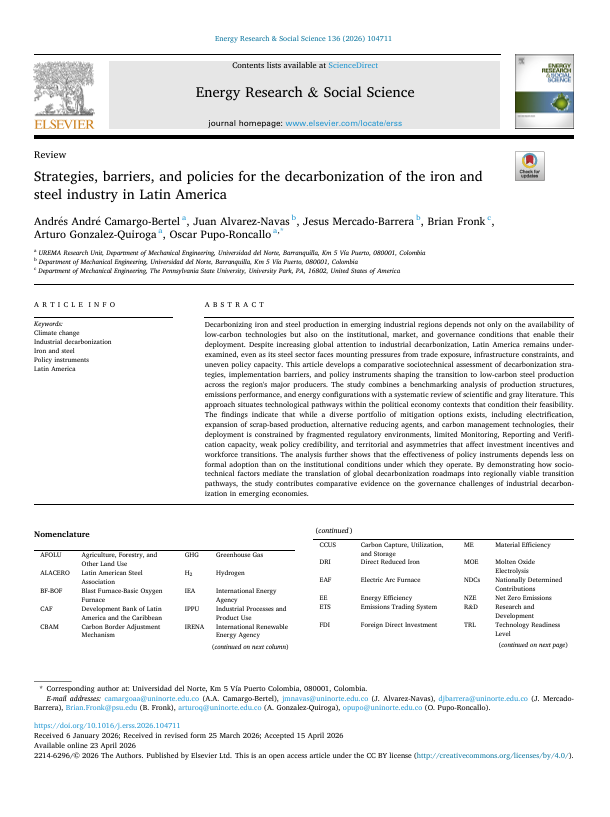
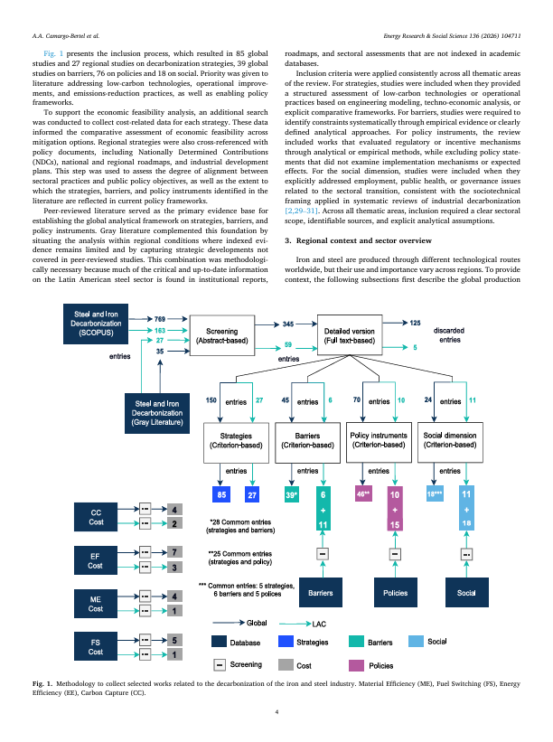
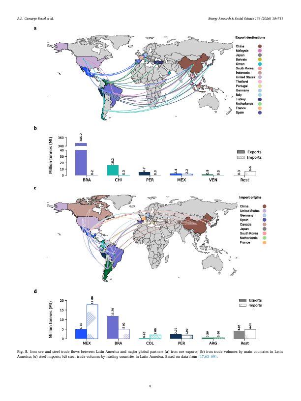
</div>
<p class="ps-journal">Energy Research &amp; Social Science</p>
<p class="ps-title">Strategies, barriers, and policies for the decarbonization of the iron and steel industry in Latin America</p>
<p class="ps-year">2026</p>
</a>

<a href="posts/paper-2025-cement-decarbonization/" class="paper-stack-card">
<div class="paper-stack">
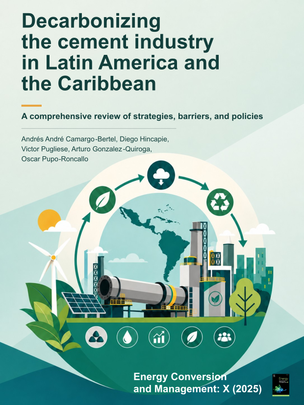
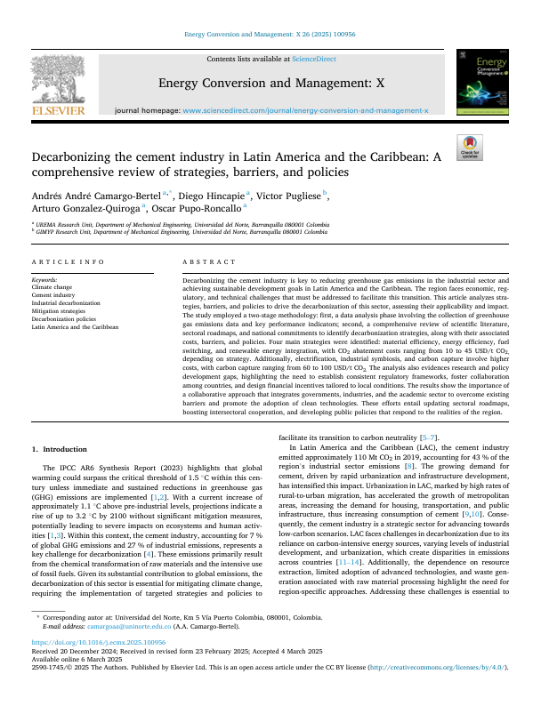
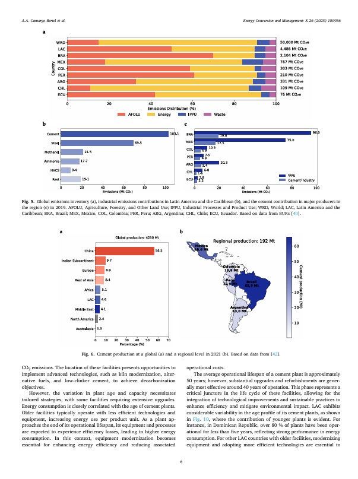
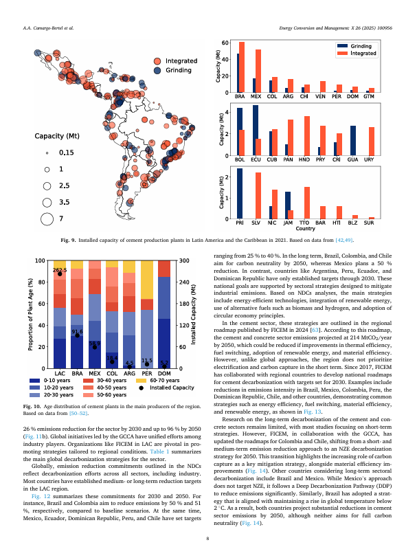
</div>
<p class="ps-journal">Energy Conversion and Management: X</p>
<p class="ps-title">Decarbonizing the cement industry in Latin America and the Caribbean: A comprehensive review of strategies, barriers, and policies</p>
<p class="ps-year">2025</p>
</a>

<a href="posts/paper-2025-transport-electrification-colombia/" class="paper-stack-card">
<div class="paper-stack">
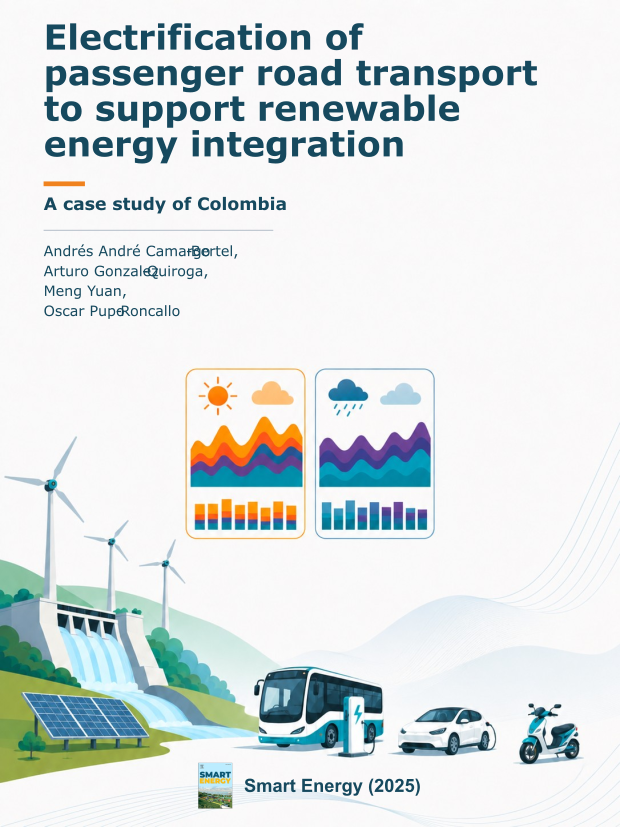
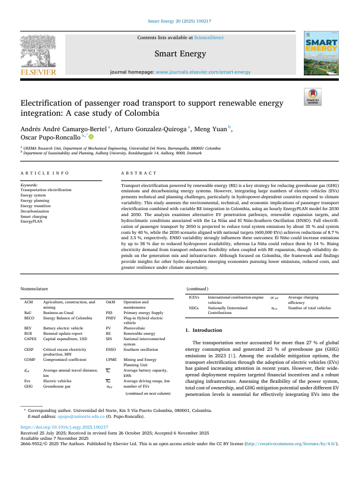
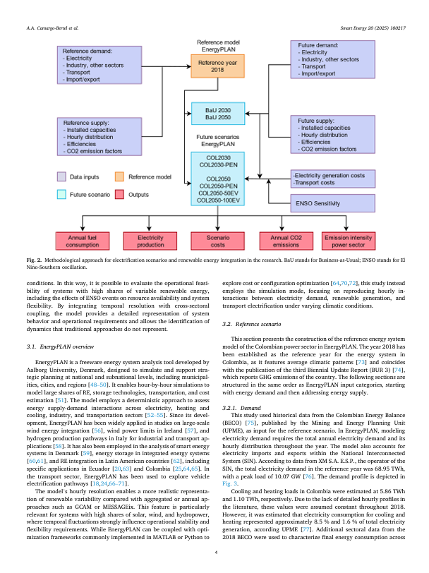
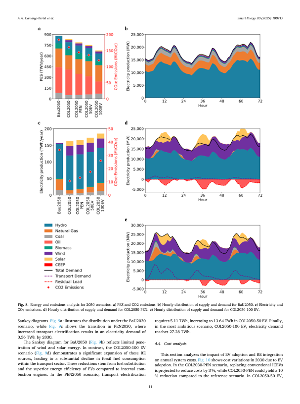
</div>
<p class="ps-journal">Smart Energy</p>
<p class="ps-title">Electrification of passenger road transport to support renewable energy integration: A case study of Colombia</p>
<p class="ps-year">2025</p>
</a>

</div>
```

::: {.button}
[More papers](publications.qmd){.btn-action-primary .btn-action .btn .btn-success .btn-lg role="button" style="margin-top: 0em;"}
:::

:::
:::

::: {.background-frame .alt-background}
::: {.content-block}

## Recent News {.home-section}

```{=html}
<div class="news-cards-grid">
<a class="news-card" href="posts/2026-01-joined-upme/">
<div class="news-card-logo"></div>
<div class="news-card-body">
<p class="news-card-year">2026</p>
<p class="news-card-title">Joined UPME as Energy Modeler</p>
</div>
</a>
<a class="news-card" href="posts/2024-100k-clima-fellowship/">
<div class="news-card-logo"></div>
<div class="news-card-body">
<p class="news-card-year">2024</p>
<p class="news-card-title">100k-Clima Fellowship at Penn State University</p>
</div>
</a>
<a class="news-card" href="posts/2024-08-phd-scholarship/">
<div class="news-card-logo"></div>
<div class="news-card-body">
<p class="news-card-year">2024</p>
<p class="news-card-title">Minciencias National PhD Scholarship</p>
</div>
</a>
</div>
```

::: {.button}
[More news](posts.qmd){.btn-action-primary .btn-action .btn .btn-success .btn-lg role="button" style="margin-top: 0em;"}
:::

:::
:::
