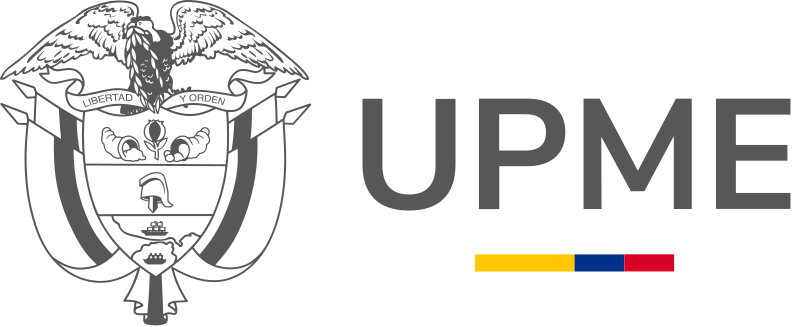
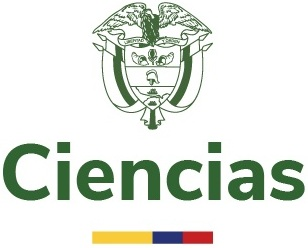

```{=html}
<div class="page-banner">
  <div class="page-banner-bg" style="background-image:url('/files/images/menu/news.png')"></div>
  <div class="page-banner-overlay"></div>
  <div class="page-banner-fade"></div>
  <div class="page-banner-title">News</div>
</div>
```

```{=html}
<div class="tl-wrap">

  <div class="tl-year">2026</div>

  <div class="tl-item">
    <div class="tl-logo">
      
    </div>
    <div class="tl-body">
      <div class="tl-date">January 2026</div>
      <div class="tl-title"><a href="posts/2026-01-joined-upme/">Joined UPME as an energy modeler</a></div>
      <p class="tl-desc">Contributing to Colombia's National Energy Plan 2025–2055 as the transport-sector modeler at the National Mining and Energy Planning Unit.</p>
    </div>
  </div>

  <div class="tl-year">2025</div>

  <div class="tl-item">
    <div class="tl-logo">
      
    </div>
    <div class="tl-body">
      <div class="tl-date">August 2025</div>
      <div class="tl-title"><a href="posts/2025-08-upme-data-analyst/">Joined UPME as an energy data analyst</a></div>
      <p class="tl-desc">Started working at Colombia's National Mining and Energy Planning Unit, supporting energy data analysis for national planning.</p>
    </div>
  </div>

  <div class="tl-year">2024</div>

  <div class="tl-item">
    <div class="tl-logo">
      
    </div>
    <div class="tl-body">
      <div class="tl-date">September 2024</div>
      <div class="tl-title"><a href="posts/2024-100k-clima-fellowship/">Selected for the 100k-Clima fellowship at Penn State University</a></div>
      <p class="tl-desc">A program supporting research collaboration and academic exchange on climate and energy topics.</p>
    </div>
  </div>

  <div class="tl-item">
    <div class="tl-logo">
      
    </div>
    <div class="tl-body">
      <div class="tl-date">August 2024</div>
      <div class="tl-title"><a href="posts/2024-08-phd-scholarship/">Awarded the Minciencias national PhD scholarship</a></div>
      <p class="tl-desc">Selected for Colombia's national PhD scholarship (Call 933) to pursue a PhD in Mechanical Engineering at Universidad del Norte.</p>
    </div>
  </div>

  <div class="tl-close"><span class="tl-close-label">2023</span></div>

</div>
```
