```{=html}
<div class="report-listing">

<div class="report-card">
<div class="report-cover">
<a href="https://docs.upme.gov.co/DemandayEficiencia/Documents/PEN_2025_2055/Plan_Energetico_Nacional_Tomo_II_Resultados_2025-2055.pdf" target="_blank">
<div class="rep-stack">
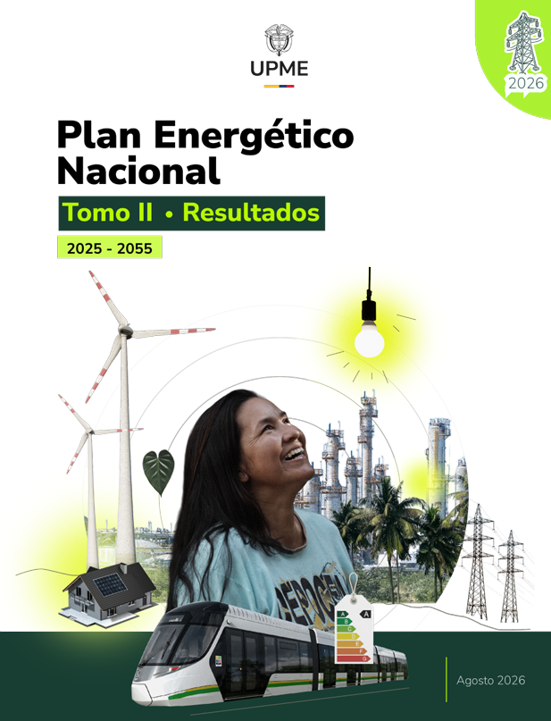
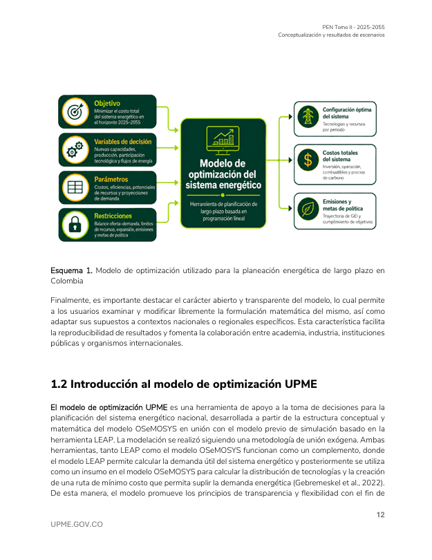
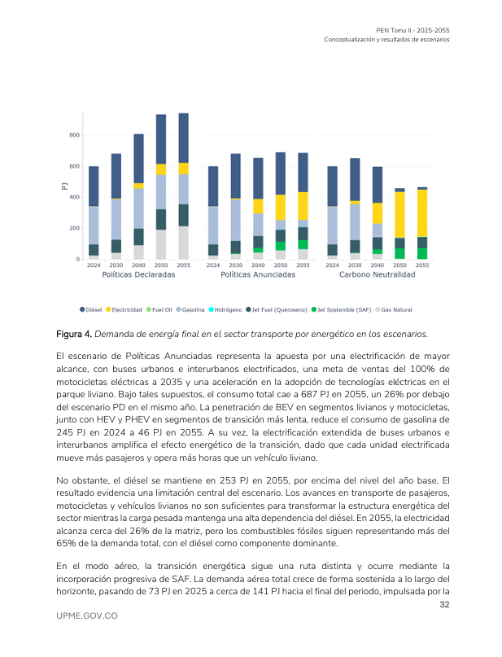
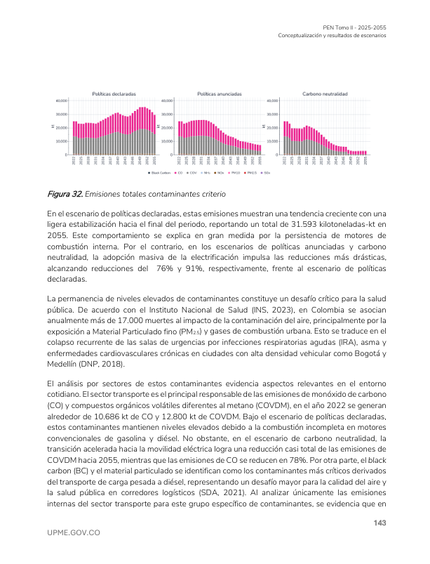
</div>
</a>
</div>
<div class="report-body">
<span class="report-badge badge-institutional">Institutional Report</span>
<span class="report-title">National Energy Plan 2025–2055, Volume II: Results</span>
<p class="report-institution">National Mining and Energy Planning Unit (UPME). Bogotá, Colombia, 2026.</p>
<p class="report-role"><em>Contributing author; energy modeler.</em></p>
<p class="report-description">Volume II of Colombia's National Energy Plan 2025–2055 presents the quantitative results of the three long-term scenarios explored in the planning process. Demand, supply, and emissions projections extend to 2055 within the Just Energy Transition framework, with emphasis on equity, reindustrialization, and a gradual move away from fossil fuel dependence.</p>
</div>
</div>

<div class="report-card">
<div class="report-cover">
<a href="https://docs.upme.gov.co/DemandayEficiencia/Documents/Proyecciones_demanda_Energia_Electrica_y_Potencia_Maxima_Rev_Julio_2026_VRF.pdf" target="_blank">
<div class="rep-stack">
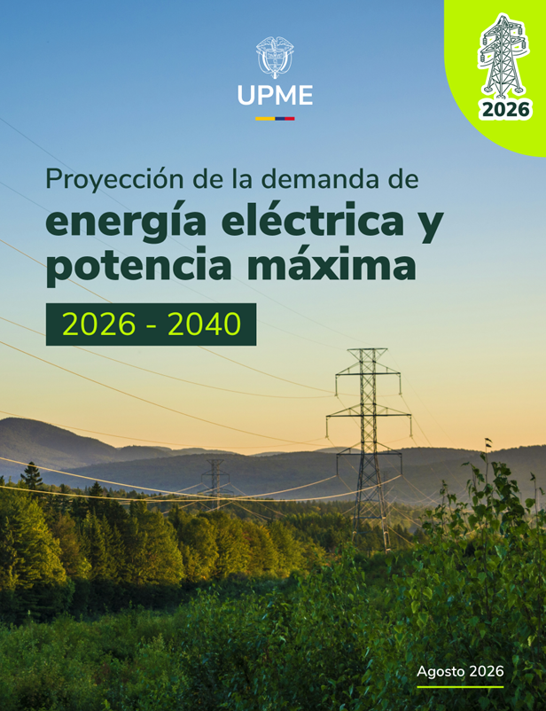
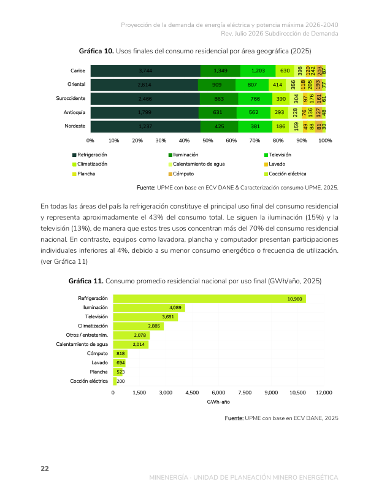
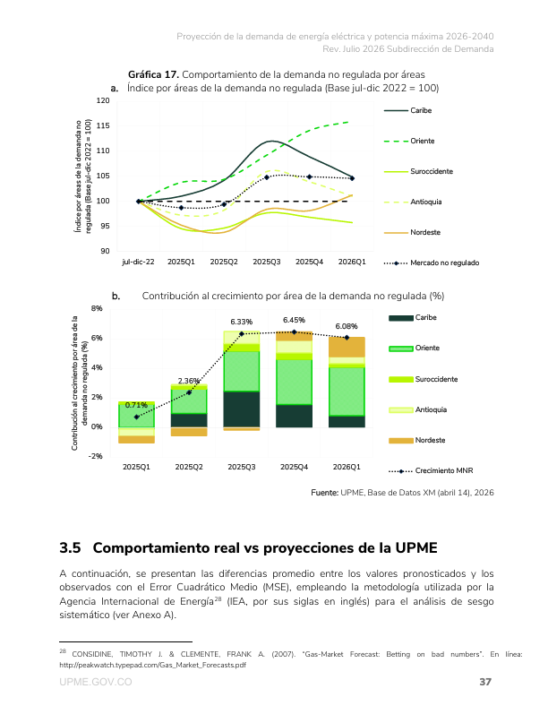
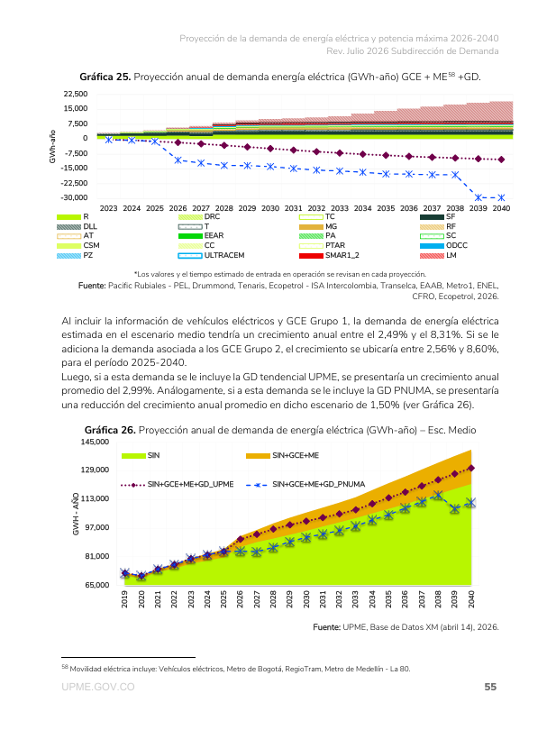
</div>
</a>
</div>
<div class="report-body">
<span class="report-badge badge-institutional">Institutional Report</span>
<span class="report-title">Projections of Electricity Demand and Maximum Power, July 2026 Revision</span>
<p class="report-institution">National Mining and Energy Planning Unit (UPME). Bogotá, Colombia, 2026.</p>
<p class="report-role"><em>Contributing author; transport electrification modeling.</em></p>
<p class="report-description">Updated electricity demand and maximum power projections for Colombia's National Interconnected System through 2040. The July 2026 revision integrates territorial disaggregation of residential consumption, refreshed sectoral data, and an assessment of El Niño effects on second-semester demand.</p>
</div>
</div>

<div class="report-card">
<div class="report-cover">
<a href="https://docs.upme.gov.co/DemandayEficiencia/Documents/PEN_2025_2055/Estructura_metodologica_regionalizacion_PEN_VF.pdf" target="_blank">
<div class="rep-stack">
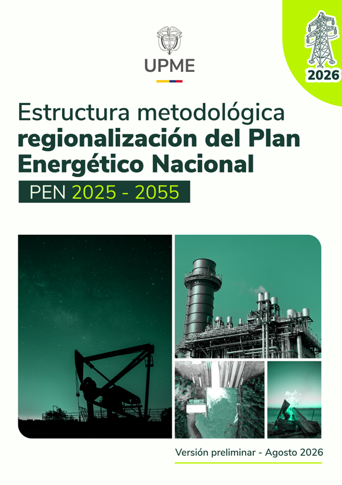
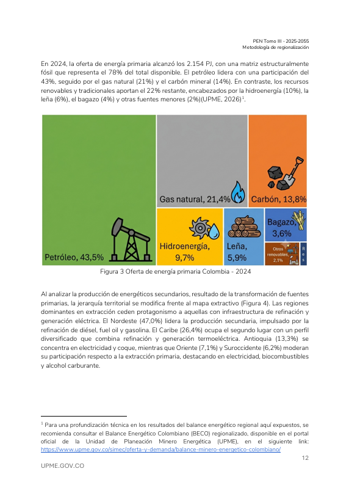
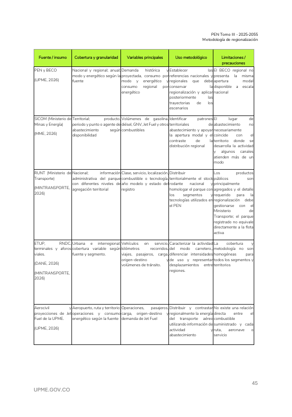
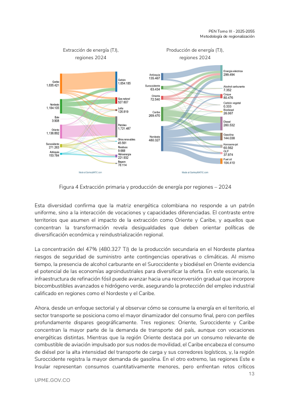
</div>
</a>
</div>
<div class="report-body">
<span class="report-badge badge-institutional">Institutional Report</span>
<span class="report-title">Methodological Framework for the Regionalization of the National Energy Plan</span>
<p class="report-institution">National Mining and Energy Planning Unit (UPME). Bogotá, Colombia, 2025.</p>
<p class="report-role"><em>Contributing author; energy modeler.</em></p>
<p class="report-description">This document lays out the methodology for disaggregating Colombia's National Energy Plan projections to the subnational level across seven planning regions, using LEAP and OSeMOSYS as modeling tools. The framework helps identify regional energy access gaps, renewable potential, and differentiated transition pathways.</p>
</div>
</div>

<div class="report-card">
<div class="report-cover">
<a href="https://docs.upme.gov.co/DemandayEficiencia/Documents/PEN_2025_2055/Estrategia_de_parametrizaci%C3%B3n_para_la_contruccion_de_escenarios_del_PEN_2025-2055.pdf" target="_blank">
<div class="rep-stack">
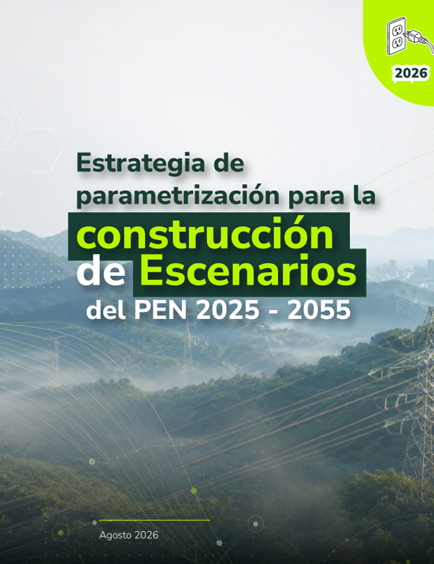
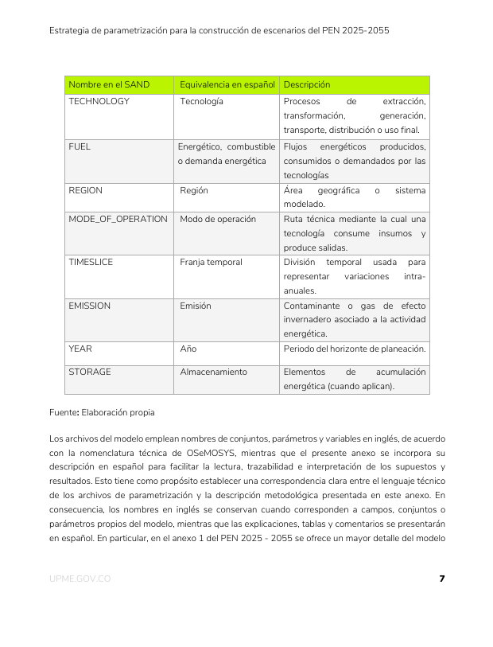
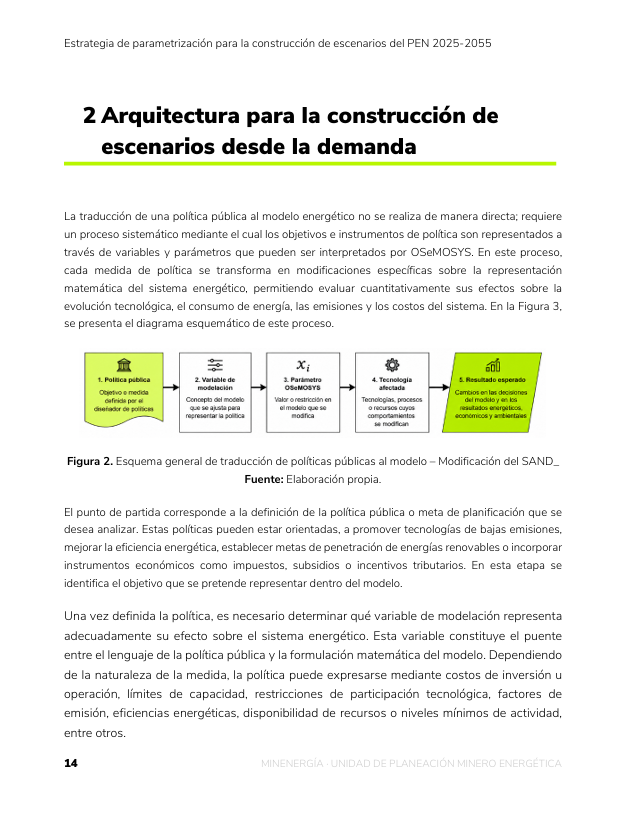
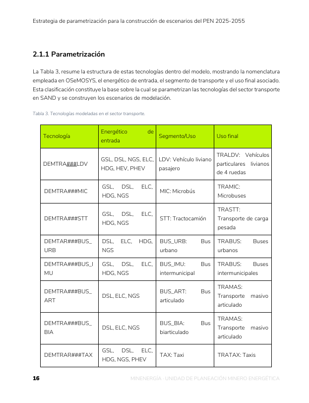
</div>
</a>
</div>
<div class="report-body">
<span class="report-badge badge-institutional">Institutional Report</span>
<span class="report-title">Parameterization Strategy for Scenario Development of the National Energy Plan 2025–2055</span>
<p class="report-institution">National Mining and Energy Planning Unit (UPME). Bogotá, Colombia, 2025.</p>
<p class="report-role"><em>Contributing author; energy modeler.</em></p>
<p class="report-description">This document describes how the energy scenarios of Colombia's National Energy Plan 2025–2055 were built using OSeMOSYS and the SAND data management tool. It explains how the technical, economic, and regulatory features of the Colombian energy system were translated into model inputs to produce the scenario results.</p>
</div>
</div>

<div class="report-card">
<div class="report-cover">
<a href="https://assets.cemnet.com/sample/magazine/icr-aug-2026-sample/index.html" target="_blank">
<div class="rep-stack">

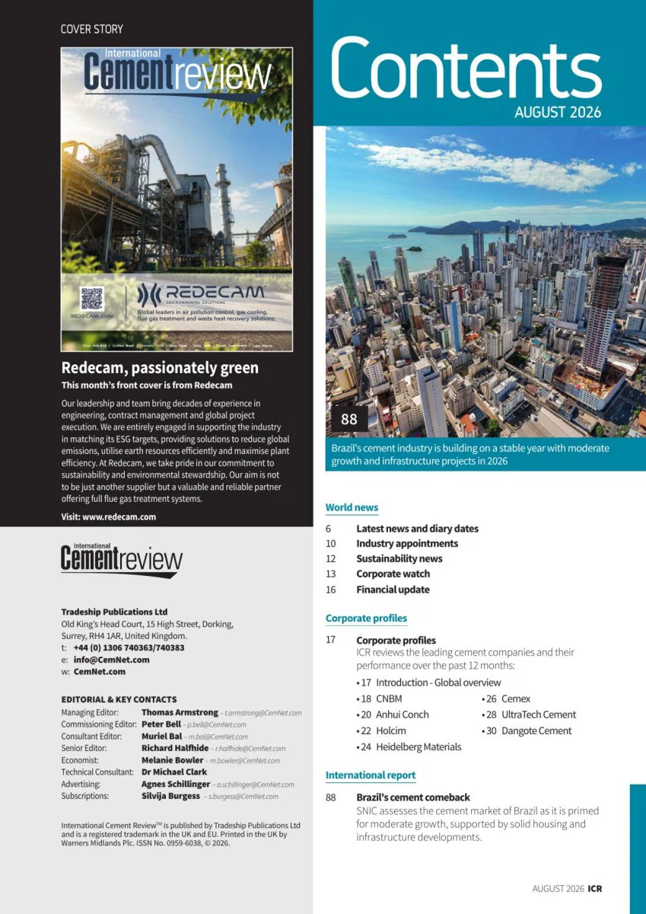
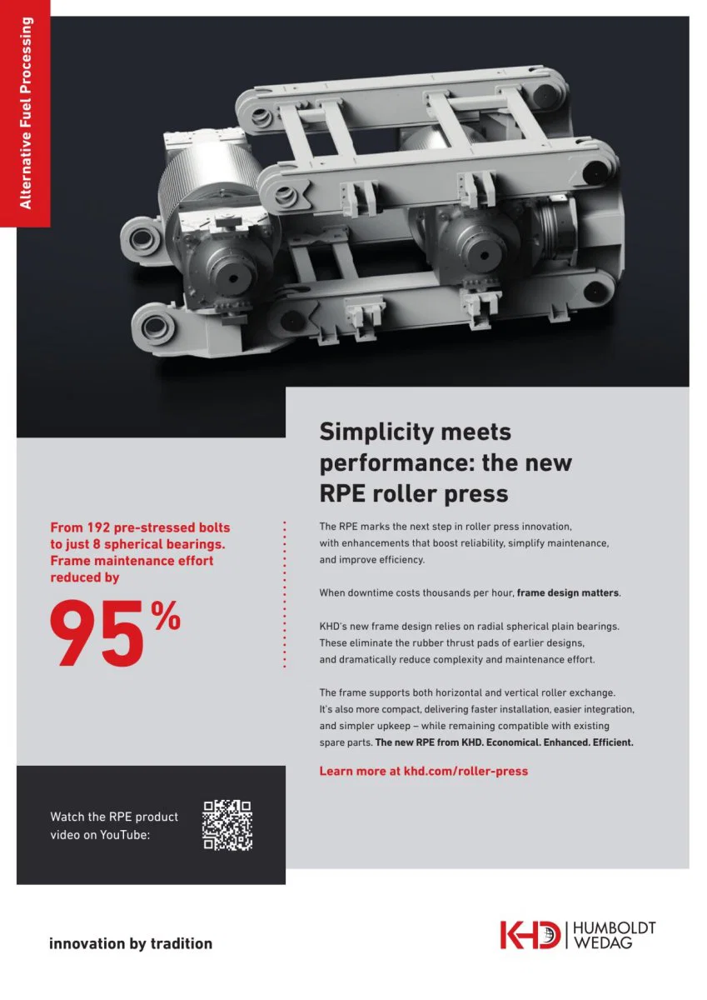

</div>
</a>
</div>
<div class="report-body">
<span class="report-badge badge-invited">Invited Contribution</span>
<span class="report-title">Decarbonizing the cement industry in Latin America and the Caribbean</span>
<p class="report-institution"><strong>Camargo-Bertel, A. A.</strong>, A. González-Quiroga, and O. Pupo-Roncallo. <em>International Cement Review</em>, August 2026.</p>
<p class="report-description">Latin America and the Caribbean produced around 183 Mt of cement in 2024. This article looks at the near-term measures available to the sector and the conditions needed to make next-generation decarbonization projects financially viable in the region, from standards reform and alternative fuels to electrification and CO₂ infrastructure.</p>
</div>
</div>

</div>
```

## Theses

```{=html}
<div class="report-listing">

<div class="report-card">
<div class="report-cover">
<a href="http://hdl.handle.net/10584/12884" target="_blank">
<div class="rep-stack">
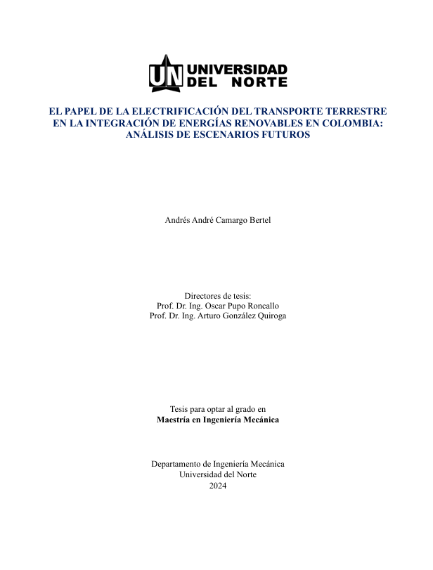
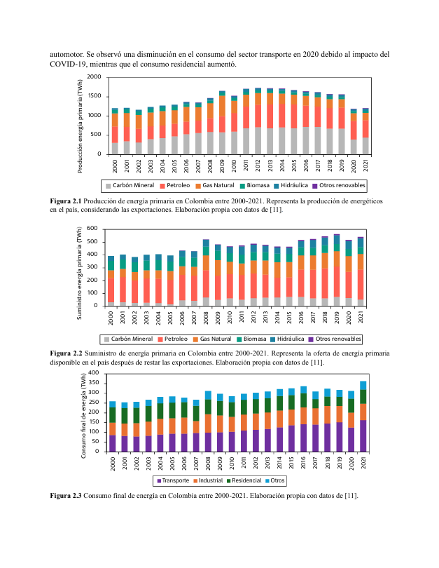
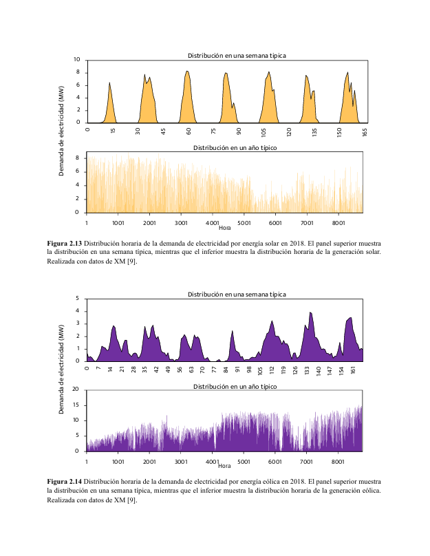
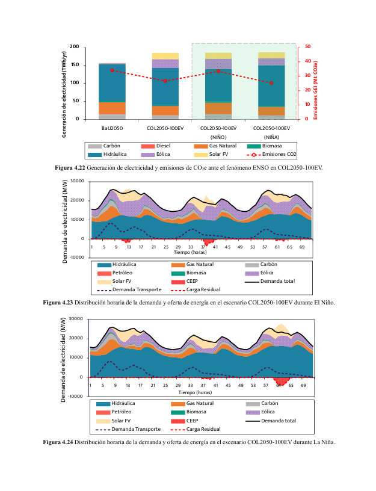
</div>
</a>
</div>
<div class="report-body">
<span class="report-badge badge-thesis">Master's Thesis</span>
<a class="report-title" href="http://hdl.handle.net/10584/12884" target="_blank">The role of passenger road transport electrification in renewable energy integration in Colombia: future scenario analysis</a>
<p class="report-institution"><strong>Camargo-Bertel, A. A.</strong> Universidad del Norte, Barranquilla, Colombia, 2024.</p>
<p class="report-role"><em>Advisors: Prof. Dr. Ing. Oscar Pupo Roncallo and Prof. Dr. Ing. Arturo González Quiroga.</em></p>
<p class="report-description">This study evaluates the impact of passenger road transport electrification on the integration of non-conventional renewable energy sources and greenhouse gas (GHG) mitigation in Colombia's energy system toward 2030 and 2050, modeled using EnergyPLAN. Results show that increased EV adoption reduces GHG emissions by 4.2% by 2030 and 15% by 2050 under projected national scenarios, with a fully electrified fleet achieving reductions of up to 35% by 2050.</p>
<div class="report-links">
<a class="report-link" href="http://hdl.handle.net/10584/12884" target="_blank">Repository</a>
</div>
</div>
</div>

</div>
```

